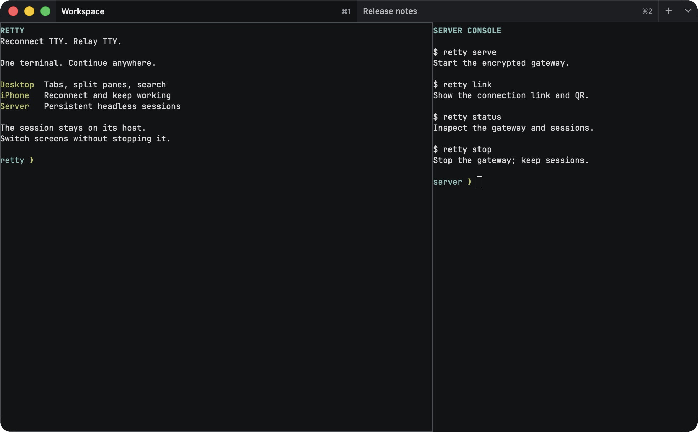
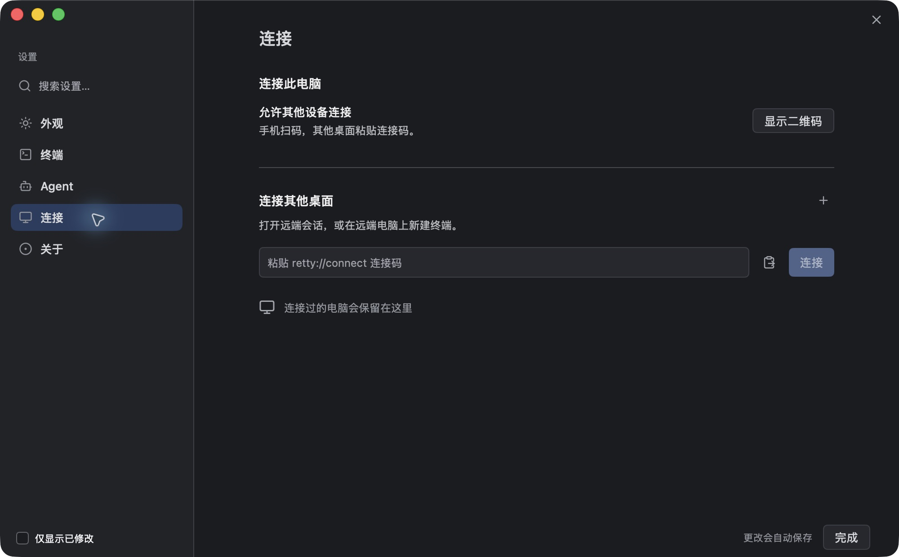

# Retty

**Reconnect TTY. Relay TTY.**

换个屏幕，接着工作。

Retty 是连接 **Mac、iPhone 和无桌面服务器** 的原生终端工作台。终端会话留在运行它的电脑或服务器上，你可以从桌面打开，在手机上继续，再回到桌面。退出界面或断开连接，会话里的 shell 和程序仍然运行。

它适合日常命令行、远程开发，以及 Codex、Claude Code、OpenCode 等终端 Agent。Retty 用 Go 编写，基于 [MyGo](https://github.com/daodao97/mygo) 的原生 UI 和 Ghostty 的 libghostty-vt；桌面界面不使用 WebView，iOS 使用 UIKit 宿主。



*桌面工作区：紧凑标签栏、左右分屏和独立终端。本文配图使用暗色模式及隔离的演示会话，终端内容为功能示例。手机配图来自 iPhone 16 模拟器中的实际 iOS 应用。*

## 一个会话，多个入口

| 入口 | 可以做什么 |
| --- | --- |
| **macOS 桌面** | 本地终端、标签页、分屏、搜索；连接另一台 Mac 或服务器，在同一工作区管理本地与远程会话。 |
| **iPhone** | 扫码连接、查看和新建会话、终端输入与选择复制、自动重连；离开电脑后继续操作。 |
| **服务器 CLI** | 在没有图形界面的 Linux/macOS 主机上常驻运行，为桌面和手机提供终端会话。 |

运行位置不会因为换设备而改变：连接服务器后，命令在服务器执行，工作目录和已安装的 Agent 也来自服务器。手机新建的会话会同步到该主机的桌面工作区；再次回到桌面，可以继续使用。

Retty 使用 Tailcat 加密连接。连接双方需要网络和可访问的中继，不需要 Tailscale 账号或单独安装 VPN，也无需为终端服务开放公网入站端口。

## 桌面：保持工作区，也保持任务

标签页支持拖动排序、双击改名；窗格支持水平/垂直分屏、拖动分隔线、聚焦和放大。普通退出后再打开，Retty 恢复标签页、分屏和仍在运行的会话。

- **终端搜索**：搜索当前屏幕及历史输出，显示匹配位置和数量。
- **选择复制**：拖选结束自动复制；可选择可见文本或原始终端文本。拖到上下边缘可滚动扩展选择，兼顾启用鼠标报告的终端程序。
- **打开链接与文件**：按住 ⌘ 点击 URL 或文件路径，文件可交给 VS Code、Cursor 或系统默认应用；支持行号、列号。
- **外观与字号**：浅色、暗色或跟随系统，内置 JetBrains Mono；字号可以调整，终端配色随外观切换。
- **命令面板**：搜索命令或跳转到具体窗格。设置页集中管理外观、终端、Agent 和连接。

常用快捷键：

| 操作 | macOS 快捷键 |
| --- | --- |
| 新建标签页 | ⌘T |
| 搜索终端 | ⌘F |
| 命令面板 | ⇧⌘P |
| 设置 | ⌘, |
| 放大 / 缩小 / 重置文字 | ⌘+ / ⌘− / ⌘0 |

### 连接另一台电脑



在对方 Retty 的 **设置 → 连接 → 显示二维码** 中取得连接码。在本机 **设置 → 连接 → 连接其他桌面** 粘贴 `retty://connect?...`，然后打开已有会话或指定远程目录新建会话。

标签栏 **＋** 旁的箭头用于选择电脑。新建标签页、⌘T 和分屏沿用当前标签页所属电脑及目录；远程标签页显示主机名称。关闭远程标签页或断开连接会保留对方的会话。

## iPhone：从列表进入同一个终端

<table>
  <tr>
    <td align="center"><br /><sub>会话列表</sub></td>
    <td align="center"><br /><sub>终端输入</sub></td>
    <td align="center"><br /><sub>显示与提醒</sub></td>
  </tr>
</table>

在桌面开启连接后，用手机首页的扫码按钮扫描二维码，也可以打开 `retty://connect` 链接。最近连接支持一键重连，并显示可达状态；连接记录保存在设备 Keychain。清理最近连接时可以勾选部分记录。

会话列表展示标题、程序图标和工作目录。右上角 **＋** 新建终端；每行的 **…** 或长按打开会话设置，可以设置手机显示名称、置顶或结束会话。需要输入的 Agent 会话优先，其次是置顶会话，其余保持服务返回顺序；普通等待输入和已完成状态不占用列表上的状态文案。

### 输入、阅读与重连

- 使用系统键盘，支持中文拼音九宫格和输入法候选。
- 扩展按键提供 Esc、Ctrl、Option、Cmd、Tab、方向键、粘贴等。修饰键支持组合，长按可锁定；发送换行后收起键盘。
- 轻点终端进入输入；滑动阅读历史，长按选择文本并复制。返回会话列表或切到后台，不会结束终端任务。
- 网络中断时保留终端页面和阅读位置，自动尝试恢复连接。恢复期间暂停输入，离线按键不会在重连后补发。
- 回到前台优先复用已有连接，必要时重新建立；连接失败时可查看阶段诊断和复制诊断报告。
- 从 iPhone 剪贴板粘贴图片到具备桌面剪贴板的 Mac 会话，再交给 Agent 的图片粘贴能力。无图形界面的服务器暂不支持图片粘贴。

### 小屏幕如何适配

**按手机尺寸显示默认开启**，在会话列表右上角的 **显示与提醒** 中调整。

打开会话时，手机接管该会话的终端尺寸，OpenCode、Claude Code 等全屏程序会按手机宽高重新绘制。桌面上的对应窗格显示手机尺寸和占用设备提示，避免两个窗口不断互相改尺寸。

返回列表、切换会话、进入后台或断开连接，会释放接管并恢复桌面尺寸；桌面也可以手动解锁。关闭这项设置时，手机在本地重排已有终端屏幕。

**同一个 PTY 同时只有一个程序布局。** Retty 同步的是同一份输入、输出和任务状态；当前活跃的远程窗格或手机接管尺寸，其余视图让出控制。远程桌面失去活跃状态会释放尺寸；被另一设备接管后，需要重新聚焦或点击才能继续，不会通过轮询反复抢占。这保证全屏终端程序按当前操作端显示，而不是为每个 Agent 实现另一套界面。

## 终端 Agent：识别和通知各有边界

Retty 识别 **37 种终端 Agent** 的标题与图标，包括 Codex、Claude Code、Gemini CLI、OpenCode、Cursor Agent、Copilot、Aider、Amp、Pi、Oh My Pi、Goose、Droid、Qwen Code、Kimi Code、Crush 等。桌面标签页、命令面板和手机会话列表使用同一份程序信息；用户自定义标题保留，Agent 退出后恢复 shell 标题。

标题/图标识别不等于完整生命周期集成。当前已验证的生命周期集成为 **Claude Code、Codex、Gemini CLI、Qwen Code**；其他程序仍可作为普通终端使用。完整目录和图标来源见 [Agent 支持](docs/agent-support.md)。

生命周期集成可展示运行、等待授权或回答、完成、失败等状态：

- **桌面提醒**：目标窗格不在当前活跃视野中时通知；点击提醒回到对应标签页和窗格。等待输入和完成/失败提醒可以分别关闭。
- **手机后台提醒**：需要 iOS 通知权限、匹配的 APNs 签名配置，以及 Mac 发送端的 APNs provider。独立通知 worker 可在桌面窗口关闭后继续观察会话；桌面正在活跃使用时抑制手机推送。
- **减少重复提醒**：按任务事件去重；新输入取消过时提醒，重新打开界面不重放历史完成事件。手机前台更新状态，后台通知点击可重连到原会话。

在 **设置 → Agent** 管理支持的集成和桌面通知；在手机的 **显示与提醒** 管理后台提醒。Retty 不代替 Agent 做授权决定，也不会自动安装 Agent 本体。

## 服务器：`retty serve`

下载对应 CLI 压缩包，解压后保留二进制旁的 Ghostty 动态库：

```sh
tar -xzf retty-linux-amd64.tar.gz
cd retty-linux-amd64
./retty serve
```

`serve` 启动后台常驻网关并返回。关闭 SSH 不会关闭网关；重复启动复用已有实例。交互终端同时显示 `retty://connect` 链接和二维码，手机可以扫码，桌面可以粘贴连接码。

```sh
./retty link       # 显示连接码和二维码
./retty status     # 查看网关和会话
./retty stop       # 停止网关，保留终端会话
```

Linux/macOS 均提供 amd64、arm64 CLI 包。Linux 需要 glibc、系统 CA 证书和可用的 PTY；当前不提供 Alpine/musl 包。服务器上的 shell、工具和 Agent 使用服务器自身环境。需要开机启动或异常退出后自动重启时，用 systemd 用户服务运行 `serve --foreground`。

安装、systemd 配置、升级流程和运行要求见 [CLI 使用说明](docs/cli.md)。

## 安装与构建

| 平台 | 当前交付方式 |
| --- | --- |
| macOS 13+ | Universal DMG，包含 Apple Silicon 和 Intel 架构。 |
| iOS 15+ | 从源码构建设备包并签名安装；Bundle ID 为 `com.daodao.retty`。 |
| Linux / macOS 服务器 | CLI 压缩包，包含 `retty`、Ghostty 动态库及说明。 |

仓库的 GitHub Actions 提供 **Build macOS DMG** 和 **Build CLI** 工作流，在推送 `main`、`v*` 标签或手动运行时构建。成功运行的 Artifacts 分别为 `Retty-macos-universal-dmg` 和 `Retty-cli-*`，保留 14 天；工作流不自动创建 GitHub Release。macOS 当前使用 ad hoc 签名，尚未做 Developer ID 公证。

从源码构建需要 **Go 1.27.1+**。MyGo 及其 CLI 由 `go.mod` 固定到支持 iOS 的 fork；正式构建使用固定依赖：

```sh
# macOS Universal 应用及 DMG
GOWORK=off go tool mygo build -platform darwin/universal .

# 四种服务器 CLI 包
GOWORK=off ./scripts/build-cli.sh --platform all

# iOS 真机：Xcode + 自己团队的证书、App ID 和设备 profile
GOWORK=off ./scripts/build-ios.sh \
  -ios-team YOUR_TEAM_ID -ios-device YOUR_DEVICE_UDID

# App Store / TestFlight：统一发布工作流，固定产物目录
./scripts/release-ios.sh package
```

iOS 发布流程使用固定版本的 [App Store Connect CLI](https://github.com/rorkai/App-Store-Connect-CLI)，成品始终在 `build/app-store/ios-arm64/`；API 认证、离线 build number、校验、上传和 TestFlight 命令见 [开发说明](docs/development.md#app-store-connect--testflight)。

iOS 需要为 `com.daodao.retty` 配置匹配的 App ID 和 provisioning profile；后台任务通知还需要启用 Push Notifications。已有安装后沿用原团队和 profile 覆盖更新。APNs key 只在发送端配置：

```sh
GOWORK=off go tool mygo push setup /private/path/AuthKey_KEYID.p8
GOWORK=off go tool mygo push status
```

完整的生产构建、签名、APNs 检查、真机测试和保留任务的更新步骤见 [开发说明](docs/development.md)。

## 会话、数据与连接码

终端由独立会话服务持有，GUI 和连接网关是访问入口。普通关闭界面、退出手机或停止网关不结束任务；显式结束会话、结束会话服务或重启主机会终止其中的程序。更新 GUI 可以复用兼容的在运行服务，已有服务的代码升级应等任务完成后安排。

| 数据 | 默认位置 |
| --- | --- |
| macOS 桌面布局、设置、服务状态 | `~/Library/Application Support/Retty` |
| CLI 服务器状态 | 用户配置目录中的 `RettyServer`，Linux 通常为 `~/.config/RettyServer` |
| iOS 最近连接、会话偏好 | 应用的 Keychain 命名空间 |

`RETTY_DIR` 或 CLI 的 `--data-dir` 可以指定独立目录。Retty 使用新的应用身份、`retty://` 链接和数据目录，不迁移或兼容先前应用的身份与连接码。

二维码和连接码包含访问该主机会话的凭据，应只交给自己的设备。不要将它们放入 README、截图、公开日志或仓库。不要通过删除真实 socket、连接身份或批量结束进程来升级应用。

## 开发

```sh
# 开发环境使用独立数据目录
RETTY_DIR="$PWD/.mygo/dev-data" GOWORK=off go tool mygo dev

# 单元检查
GOWORK=off go test ./...
GOWORK=off go vet ./...

# CLI 检查
GOWORK=off CGO_ENABLED=0 go test -tags retty_cli \
  ./cmd/retty ./internal/rex ./internal/remote ./internal/terminal/screen
```

[开发说明](docs/development.md) 包含 SDK 固定规则、隔离测试和升级约束；[终端显示设计](docs/terminal-dual-render.md) 记录多端显示的探索过程，当前行为以本文和实现为准。

| 模块 | 职责 |
| --- | --- |
| `main.go`、`state.go`、`view.go` | 桌面入口、布局恢复与标签/窗格 |
| `mobile*.go` | iOS 连接、会话、键盘、显示与恢复 |
| `desktop_connections*.go` | 桌面远程主机与会话 |
| `cmd/retty` | 无图形界面的 CLI 网关 |
| `internal/rex` | PTY、持久会话、屏幕快照和尺寸接管 |
| `internal/remote` | Tailcat 加密传输、连接健康检查与恢复 |
| `internal/agents`、`internal/push` | Agent 生命周期、通知与 APNs worker |
| `internal/terminal` | 终端渲染、输入、搜索与选择 |

## 致谢

Retty 的桌面工作区受到 [Superlogical Rex](https://www.superlogical.com/updates/public-testing-beginning) 启发，使用 [MyGo](https://github.com/daodao97/mygo)、[Ghostty](https://github.com/ghostty-org/ghostty) 和 [Tailcat](https://github.com/tailscale/tailcat)。

图标来自 Lucide、Simple Icons 及各 Agent 的品牌资源，字体为 JetBrains Mono。终端和素材的来源与许可保留在 [internal/terminal/UPSTREAM.md](internal/terminal/UPSTREAM.md)、[assets/agents/UPSTREAM.md](assets/agents/UPSTREAM.md) 及对应目录。
