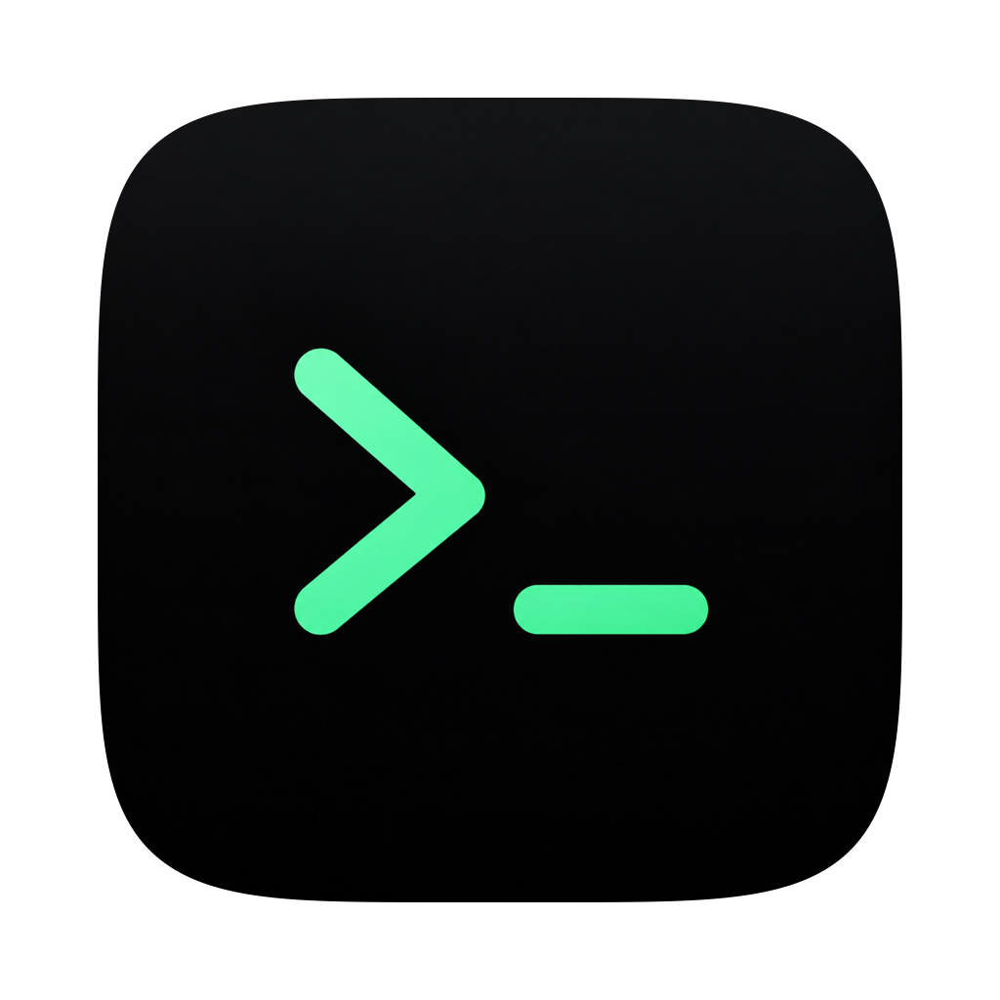
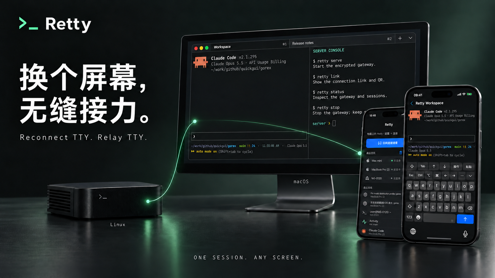
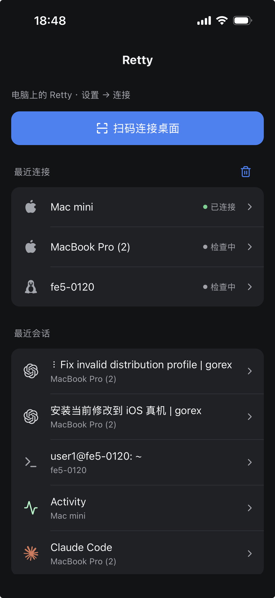
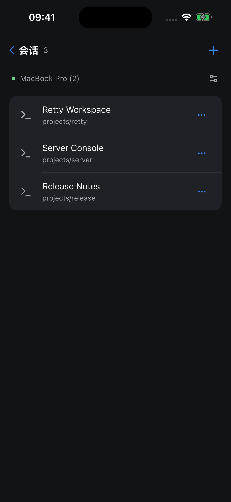
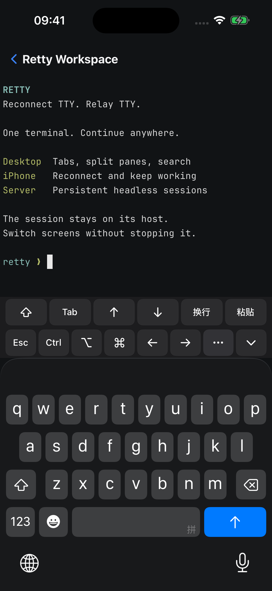
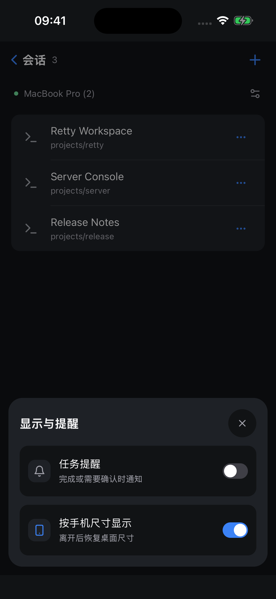
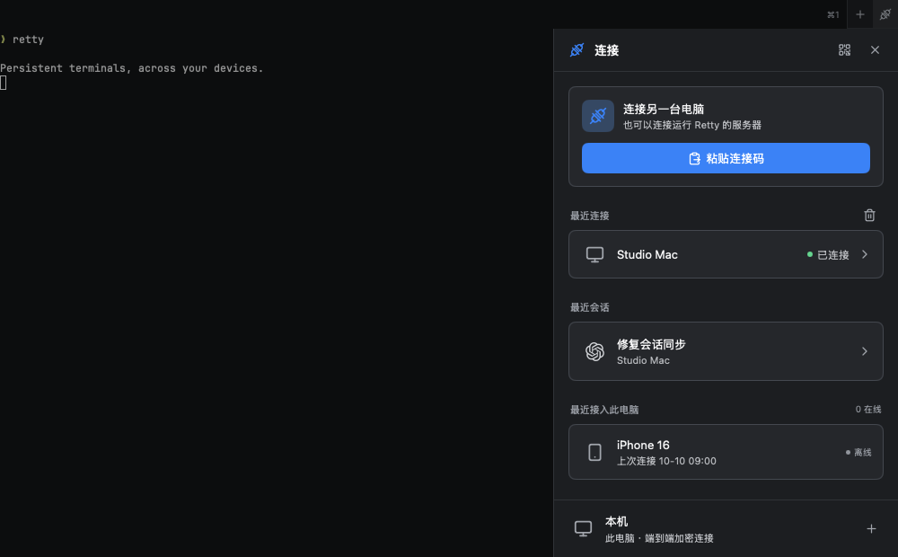

<p align="center">
  
</p>

<h1 align="center">Retty</h1>

<p align="center">
  <b>终端的无缝接力</b><br />
  换个屏幕，无缝接力。
</p>

<p align="center">
  macOS · iPhone · Linux / macOS 服务器 &nbsp;|&nbsp; 原生 UI，无 WebView &nbsp;|&nbsp; 为终端 Agent 而生
</p>

<p align="center">
  Tailcat 端到端加密连接 &nbsp;|&nbsp; 无需自建服务器 &nbsp;|&nbsp; 无需 VPN 或开放入站端口
</p>

<p align="center">
  <a href="https://github.com/daodao97/retty/releases/download/v0.1.1/Retty-0.1.1-macos-universal.dmg"></a>
  &nbsp;
  <a href="https://testflight.apple.com/join/fvYUeH4Z"></a>
</p>



在 Mac 上让 Claude Code 跑起来，出门后在 iPhone 上看它进行到哪、继续 Agent 对话，回到桌前继续——**始终是同一个终端会话**。

Retty 把 shell 交给一个常驻的会话服务：关掉窗口、锁上手机、断开 SSH，里面的程序都照常运行；任何一台设备重新连上，都能精确恢复到当前屏幕。

电脑、手机与远程主机之间通过 [Tailcat](https://github.com/tailscale/tailcat) 建立**端到端加密连接**，扫码或粘贴连接码即可接续终端，**无需自建服务器**，也无需 Tailscale 账号、VPN 或开放入站端口。

## 为什么是 Retty

- **🔁 会话永不中断**　终端由后台服务持有，界面只是入口。退出 App、网络断开、切换设备都不会结束任务，全屏程序重连后原样恢复。
- **📱 一部手机，所有电脑**　扫码连上 Mac 和 Linux 服务器，首页汇总各主机的最近会话，一点直达。看到的是同一个 PTY，不是截图或简化视图；全屏程序按手机屏幕重新绘制。
- **🤖 懂 Agent 的终端**　识别 37 种终端 Agent 的名称和图标；Claude Code、Codex、Gemini CLI、Qwen Code 等待授权、完成或失败时，在桌面或手机上提醒你。
- **🌐 加密互连，无需自建服务器**　Mac、iPhone 与 Linux 主机通过 Tailcat 端到端加密隧道互连。扫码或粘贴连接码即可连接，无需 Tailscale 账号、VPN 或开放入站端口；无桌面的主机运行 `retty serve` 即可接入。
- **⚡ 原生且轻量**　Go 编写，基于 [MyGo](https://github.com/daodao97/mygo) 原生 UI 与 Ghostty 的 libghostty-vt 渲染终端；桌面不用 WebView，iOS 使用 UIKit 宿主。

## 三步上手

1. **桌面**：安装 macOS 版 Retty，像普通终端一样使用——标签页、分屏、搜索都在。
2. **配对**：点击桌面右上角的 **连接按钮 → 本机二维码**。
3. **继续**：用 iPhone 上的 Retty 扫码，或在另一台 Mac 的连接侧边栏点击 **粘贴连接码**，使用 `retty://connect?...` 链接。

在服务器上，同样只需一条命令：

```sh
tar -xzf retty-linux-amd64.tar.gz && cd retty-linux-amd64
./retty serve   # 后台常驻，输出连接链接和二维码
```

## iPhone：口袋里的同一个终端

<table>
  <tr>
    <td align="center"><br /><sub>首页：多台主机，最近会话一点直达</sub></td>
    <td align="center"><br /><sub>会话列表：需要你处理的 Agent 排在最前</sub></td>
    <td align="center"><br /><sub>扩展按键：Esc / Ctrl / 方向键 / 粘贴</sub></td>
    <td align="center"><br /><sub>按手机尺寸显示与后台提醒</sub></td>
  </tr>
</table>

- **多台主机，一个入口**：Mac mini、MacBook、Linux 服务器并列在最近连接中，实时显示是否可达。回到首页时按需连接，点击电脑或最近会话才建立连接；在会话页面切回前台仍恢复原会话。首页的“最近会话”跨主机汇总，并标出各会话所在的主机，不用先选主机再翻列表。
- **一眼认出每个任务**：Agent 会话以任务标题和 Agent 图标显示（如 Codex 正在“Fix invalid distribution profile”、Claude Code、服务器上的 shell），不再是一排 `zsh`。
- **为手机重新排版**：打开会话时手机接管 PTY 尺寸，全屏程序按手机宽高重绘；离开或锁屏后把尺寸还给桌面。活跃会话每 5 秒续期，30 秒未收到续期会自动释放占用，即使断网或锁屏通知没有送达也不会一直锁住桌面。同一时刻只有一个设备决定布局，不会互相抢占。
- **顺手的输入**：系统键盘与中文输入法，修饰键可组合、长按锁定；长按选择复制，还能把 iPhone 剪贴板里的图片粘贴给 Mac 上的 Agent。
- **断网不慌**：保留页面和阅读位置，自动重连；离线按键不会在恢复后补发。连接失败时可以查看分阶段诊断。
- **会话管理**：新建、命名、置顶、结束会话；最近连接保存在 Keychain，一键重连。

## 桌面：一个窗口管理所有主机



- **工作区自动恢复**：标签页、分屏和仍在运行的会话，在重新打开后原样回来。
- **连接集中管理**：右上角的双插头连接按钮打开侧边栏，复用手机的连接列表、卡片和重连组件，并采用紧凑的桌面样式。粘贴连接码、选择电脑、打开或新建远端会话、清除指定连接记录，以及本机二维码都在这里。最近接入此电脑的手机和桌面会保留记录，可单独断开其控制与终端连接，保留正在运行的任务；当前桥接中的连接暂停后，可点击插头按钮允许重新连接。设置页不再重复显示连接列表，打开侧边栏不改变终端尺寸。
- **本地与远程混排**：新标签和分屏沿用当前主机和目录；侧边栏也可新建本地会话。关闭远程标签不会结束对方的会话。
- **连接指标**：最近连接的 `ⓘ` 弹层显示直连／中继、链路延迟，以及最近 5 分钟的请求耗时、超时和重连记录；桌面连接会自动尝试直连并持续低频检查路径，未采集的数据显示“暂无”。
- **远程 tab 保活**：离开窗格或窗口失焦立即释放输入与尺寸控制，画面连接保留 60 秒；返回时沿用已更新的画面。如果其他设备接管了会话，点击“接入当前窗格”才重新取得控制。
- **文件拖入终端**：本地窗格插入文件路径；Retty 远程窗格先上传文件或文件夹，再插入远端路径，不自动回车。上传有进度和取消按钮，离开窗格会取消。远端需运行支持上传的桌面端或 CLI 网关；在普通本地终端里手动运行 `ssh` 不会自动上传。
- **为日常而做**：终端内搜索历史输出、拖选即复制、⌘ 点击打开 URL 和 `file:line:col`（可交给 VS Code / Cursor）、命令面板、浅色/暗色主题、内置 JetBrains Mono。

| 新建标签页 | 搜索 | 命令面板 | 设置 | 字号 |
| :---: | :---: | :---: | :---: | :---: |
| ⌘T | ⌘F | ⇧⌘P | ⌘, | ⌘+ / ⌘− / ⌘0 |

## 终端 Agent：不用一直盯着

Codex、Claude Code、Gemini CLI、OpenCode、Cursor Agent、Copilot、Aider、Amp、Goose、Droid、Qwen Code、Kimi Code、Crush……Retty 识别 **37 种** 终端 Agent，在标签页、命令面板和手机列表中显示对应名称和图标。

对 **Claude Code、Codex、Gemini CLI、Qwen Code**，Retty 还接入了完整的生命周期：

- 运行中、等待授权 / 回答、完成、失败，状态一目了然；
- 正在前台查看当前窗格时静默；人在电脑前时只发桌面通知，点击直达对应窗格；
- 锁屏、休眠或连续 5 分钟无键鼠操作后优先通过 APNs 推送到一台 iPhone，没有可用手机推送订阅时保留桌面提醒；
- 同一事件由会话所在电脑统一分配给一个接收端，桌面和手机不重复提醒；
- 按任务去重，新输入会取消过时提醒，重开界面不会重放旧通知。

Retty 也支持 **OSC 7501（Program Status Protocol）**：任何发送该协议的终端程序，都能直接报告运行、进度、等待操作、完成和失败，供桌面、手机与服务器共享，无需专用 Hook。用法和更新要求见 [终端程序状态协议](docs/program-status.md)。

**重启电脑后恢复对话**：启用生命周期集成的 Codex / Claude Code 会保存真实会话 ID。重新打开桌面 Retty 时，存活进程直接重连；进程已消失则在原目录 resume 对应对话，保留标签页和分屏，等待新的输入。主动结束的会话不会自动恢复；恢复失败时保留窗格，可手动重试。详见 [Agent 会话恢复](docs/agent-recovery.md)。

Retty 只负责观察与提醒，不替 Agent 做授权决定，也不安装 Agent 本体。完整支持列表见 [Agent 支持](docs/agent-support.md)。

## 服务器：`retty serve`

在没有图形界面的 Linux / macOS 主机上，`retty serve` 启动后台网关后立即返回，关闭 SSH 也不受影响，重复执行会复用已有实例。

```sh
./retty link     # 再次显示连接码和二维码
./retty status   # 查看网关和会话
./retty stop     # 停止网关，保留终端会话
```

命令在服务器上执行，使用服务器自己的 shell、工具和 Agent。提供 Linux / macOS 的 amd64、arm64 包（Linux 需 glibc，暂不支持 musl）。systemd 配置、升级与运行要求见 [CLI 使用说明](docs/cli.md)。

## 下载

| 平台 | 获取方式 |
| --- | --- |
| macOS 13+ | [GitHub Releases](https://github.com/daodao97/retty/releases/latest) 的 Universal DMG（Apple Silicon + Intel）。当前尚未配置 Developer ID，下载后可能被 Gatekeeper 拦截，见[安装说明](docs/development.md#下载后提示已损坏)。 |
| iOS 15+ | [通过 TestFlight 安装](https://testflight.apple.com/join/fvYUeH4Z)，也可从源码构建并用自己的证书签名安装（Bundle ID `com.daodao.retty`）。 |
| Linux / macOS 服务器 | [GitHub Releases](https://github.com/daodao97/retty/releases/latest) 的 `retty-{系统}-{架构}.tar.gz`，包含 `retty` 与 Ghostty 动态库。 |

推送 `main` 时生成日常构建，Actions Artifacts 保留 14 天。推送与 `mygo.json.version` 对应的 `v*` 标签，或手动运行 **Release**，会构建四个平台的 CLI 和 Universal DMG，校验后发布到 GitHub Release，每个包附有 SHA-256 文件。正式签名与公证的配置见[开发说明](docs/development.md#github-release)。

## 安全须知

> [!WARNING]
> 二维码和 `retty://connect` 链接包含访问该主机全部会话的凭据，相当于一把完整的钥匙。只交给自己的设备，不要放进截图、日志、Issue 或仓库。

会话只会在显式结束会话、停止会话服务或重启主机时终止。升级时不要删除 socket、连接身份或批量结束 Retty 进程；新版 GUI 会直接复用兼容的在运行服务。

| 数据 | 默认位置 |
| --- | --- |
| macOS 桌面 | `~/Library/Application Support/Retty` |
| CLI 服务器 | 用户配置目录下的 `RettyServer`（Linux 通常为 `~/.config/RettyServer`） |
| iOS | 应用 Keychain |

可用 `RETTY_DIR` 或 CLI 的 `--data-dir` 指定独立目录。

## 从源码构建

需要 **Go 1.27.1+**。MyGo 及其 CLI 由 `go.mod` 固定。

```sh
# 开发（独立数据目录，不影响正在使用的会话）
RETTY_DIR="$PWD/.mygo/dev-data" GOWORK=off go tool mygo dev

# macOS Universal 应用及 DMG
GOWORK=off go tool mygo build -platform darwin/universal .

# 服务器 CLI（四个平台）
GOWORK=off ./scripts/build-cli.sh --platform all

# iOS 真机
GOWORK=off ./scripts/build-ios.sh -ios-team YOUR_TEAM_ID -ios-device YOUR_DEVICE_UDID

# 测试
GOWORK=off go test ./... && GOWORK=off go vet ./...
```

<details>
<summary>App Store / TestFlight、APNs 与代码结构</summary>

iOS 发布使用固定版本的 [App Store Connect CLI](https://github.com/rorkai/App-Store-Connect-CLI)，产物位于 `build/app-store/ios-arm64/`：

```sh
./scripts/release-ios.sh package
```

后台通知需要为 `com.daodao.retty` 启用 Push Notifications，并在发送端配置 APNs key：

```sh
GOWORK=off go tool mygo push setup /private/path/AuthKey_KEYID.p8
GOWORK=off go tool mygo push status
```

CLI 检查：

```sh
GOWORK=off CGO_ENABLED=0 go test -tags retty_cli \
  ./cmd/retty ./internal/rex ./internal/remote ./internal/terminal/screen
```

| 模块 | 职责 |
| --- | --- |
| `main.go`、`state.go`、`view.go` | 桌面入口、布局恢复与标签/窗格 |
| `mobile*.go` | iOS 连接、会话、键盘、显示与恢复 |
| `desktop_connections*.go` | 桌面远程主机与会话 |
| `cmd/retty` | 无图形界面的 CLI 网关 |
| `internal/rex` | PTY、持久会话、屏幕快照和尺寸接管 |
| `internal/remote` | Tailcat 加密传输、连接健康检查与恢复 |
| `internal/agents`、`internal/push` | Agent 生命周期、通知与 APNs worker |
| `internal/terminal` | 终端渲染、输入、搜索与选择 |

</details>

完整的签名、真机测试和保留任务的更新流程见 [开发说明](docs/development.md)；多端显示的设计探索见 [终端显示设计](docs/terminal-dual-render.md)。

## 致谢

Retty 的桌面工作区受 [Superlogical Rex](https://www.superlogical.com/updates/public-testing-beginning) 启发，构建于 [MyGo](https://github.com/daodao97/mygo)、[Ghostty](https://github.com/ghostty-org/ghostty) 和 [Tailcat](https://github.com/tailscale/tailcat) 之上。

图标来自 Lucide、Simple Icons 及各 Agent 的品牌资源，字体为 JetBrains Mono。来源与许可见 [internal/terminal/UPSTREAM.md](internal/terminal/UPSTREAM.md) 和 [assets/agents/UPSTREAM.md](assets/agents/UPSTREAM.md)。
